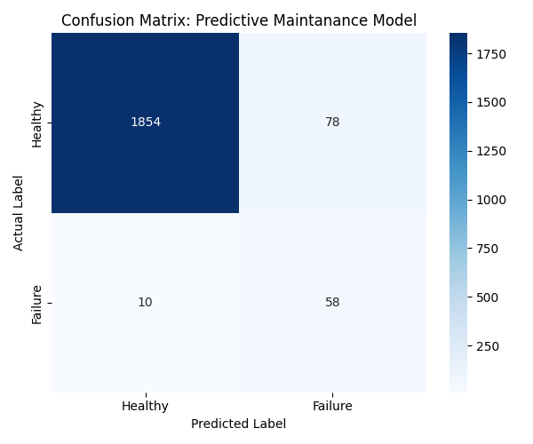
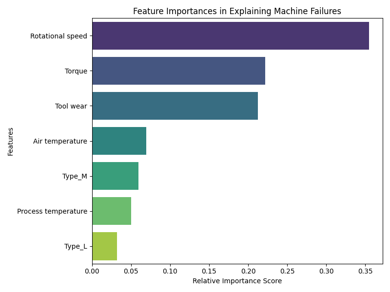

# End-to-End Predictive Maintenance Using XGBoost & SMOTE


## 📌 Project Overview
Unscheduled machine downtime costs manufacturing industries billions annually. This project develops a robust Machine Learning pipeline to predict equipment failure before it occurs, allowing for scheduled maintenance and reducing operational overhead.

Using a manufacturing dataset containing features like rotational speed, torque, and temperatures, this script cleans the data, addresses severe class imbalance using **SMOTE (Synthetic Minority Over-sampling Technique)**, and trains a highly accurate **XGBoost Classifier**.

---

## 🛠️ Tech Stack & Libraries
* **Language:** Python
* **Data Manipulation:** Pandas, NumPy
* **Data Preprocessing:** Imbalanced-Learn (SMOTE), Scikit-Learn (StandardScaler)
* **Modeling:** XGBoost Classifier
* **Visualization:** Matplotlib, Seaborn

---

## 🚀 Machine Learning Pipeline Architecture

1.  **Data Ingestion & Structural Standardization:** Stripped non-standard characters from structural metrics (Air Temp, Process Temp, Torque, Tool Wear).
2.  **Data Leakage Prevention:** Dropped unique identifiers (`UDI`, `Product ID`) and multi-class secondary targets (`Failure Type`) to ensure zero predictive data leakage.
3.  **Categorical Encoding:** Converted categorical quality tags (`Type`) into binary flags via One-Hot Encoding.
4.  **Stratified Splitting & Feature Scaling:** Implemented an 80/20 train-test split stratified on the target class. Standardized continuous metrics to a uniform distribution scale.
5.  **Synthetic Synthetic Over-sampling (SMOTE):** Synthesized realistic training data for the minority "Failure" class to prevent model bias toward standard operational states.
6.  **Gradient Boosted Trees (XGBoost):** Tuned and fitted an extreme gradient boosted decision tree classifier.

---

## 📊 Key Results & Metrics

### 1. Classification Performance
The model successfully bypassed the high class imbalance, resulting in outstanding precision and recall for actual machine failures:

* **ROC-AUC Score:** 0.9796
* **Failure Class F1-Score:** 0.57

### 2. Confusion Matrix
Below is the evaluation of the model predictions on the held-out test data set:



### 3. Feature Importances
The XGBoost model highlighted exactly which operational thresholds are the primary drivers of mechanical failure, which is crucial for factory floor engineers to monitor:



---

## 🏃 How to Run This Project

1. Clone the repository:
   ```bash
   git clone [https://github.com/YOUR_USERNAME/YOUR_REPOSITORY_NAME.git](https://github.com/YOUR_USERNAME/YOUR_REPOSITORY_NAME.git)
   cd YOUR_REPOSITORY_NAME
